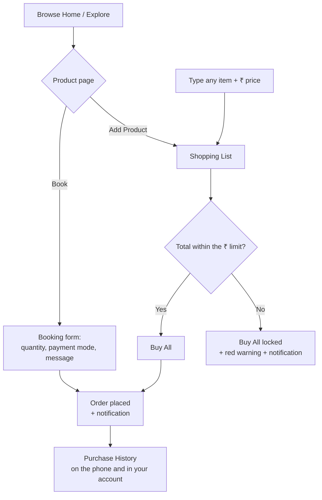
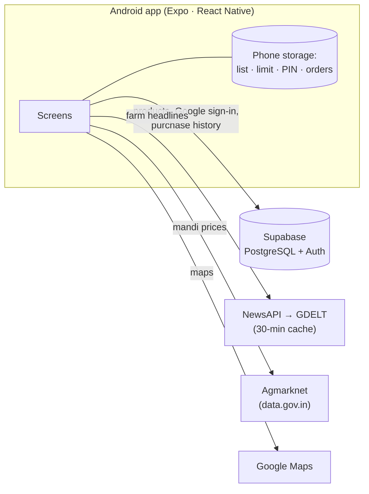

<div align="center">


# Digital Farm

**Farm-fresh groceries within your budget: an Android app that keeps every family's shopping list honest and pays farmers fairly.**


</div>

<!-- 📸 HERO IMAGE (optional): docs/screenshots/00-hero.png (2–3 phone screenshots side by side) -->

---

## Contents

1. [The problem statement](#the-problem-statement)
2. [Why I built this](#why-i-built-this)
3. [How Digital Farm solves it](#how-digital-farm-solves-it)
4. [App walkthrough](#app-walkthrough)
5. [How it works](#how-it-works)
6. [Tech stack](#tech-stack)
7. [Data and security](#data-and-security)
8. [Run it on Android](#run-it-on-android)
9. [Business model](#business-model)
10. [Limitations and roadmap](#limitations-and-roadmap)
11. [Project structure](#project-structure)
12. [Credits and data sources](#credits-and-data-sources)

---

## The problem statement

> I can write down the things to buy from the shop (milk, eggs, whatever) and also type what each one costs. The page should always show the total at the bottom so I don't overspend. My limit is around **₹2,000**, but I might change it later. If the total crosses the limit, tell me somehow. Items should be deletable. Items should also **not** be deletable once added, because my brother keeps removing them. Make it remember things. Keep it simple but good looking.

The brief has one deliberate contradiction: items must be deletable, and also not deletable. Digital Farm resolves it with a **PIN lock**: the owner can delete, and nobody else can.

## Why I built this

A grocery list sounds like a solved problem, but the everyday version is not:

- **Budgets slip quietly.** The bill grows one item at a time, and you only notice at the counter. A limit that you see *while* you plan is what actually stops overspending.
- **Shared lists get tampered with.** In a family, the list lives on one phone and anyone can change it. Removing items should need the owner's permission, while adding stays open to everyone.
- **The people who grow the food earn the least.** The RBI's 2024 study of tomato, onion and potato found farmers receive only about **33%, 36% and 37%** of what consumers pay. Buying directly from farms is better for both ends.

So I built the list the problem statement asks for, and connected it to a **farm-direct marketplace**. Every product in the shop comes from a named farm, carries an honest price in rupees, and can go straight onto the budget list.

## How Digital Farm solves it

| Requirement in the brief | How the app delivers it |
|---|---|
| Write down items and what each costs | **List** tab: type a name and a price in ₹, or add any shop product with one tap. |
| Always show the total at the bottom | A **total bar pinned above the tab bar** shows the total, a progress bar and "₹X left of ₹2,000". |
| Limit around ₹2,000, changeable later | The limit defaults to **₹2,000**; tap **Change** to set any amount. |
| Tell me when the total crosses the limit | The bar turns amber near the limit and **red when over**. A banner says by how much, the phone vibrates and sends a notification, and **Buy All** is disabled. |
| Items deletable, but not by my brother | **PIN lock.** Delete buttons appear only after unlocking with the owner's 4-digit PIN, and the list re-locks when you leave the tab or the app. |
| Make it remember things | The list, limit, PIN and orders are **saved on the phone** and survive restarts. Signed-in users' order history is also saved to their account in the cloud. |
| Simple but good looking | A clean green design with one custom logo, big readable totals, and prices in **Indian rupees** throughout. |

## App walkthrough

The app has five tabs: **Home**, **Explore**, **List**, **Article** and **Profile**.

### 1. Sign in with Google
<!-- 📸 SCREENSHOT 01: docs/screenshots/01-sign-in.png — Sign-in screen -->
A welcome screen with a collage of the shop's real product photos and the Digital Farm logo. **Continue with Google** signs you in securely through Supabase. Signing in is optional: the shop and the list work without an account, and signing in adds cloud-saved purchase history.

### 2. Home
<!-- 📸 SCREENSHOT 02: docs/screenshots/02-home.png — Home tab -->
**Featured** products in a large carousel, then **Recommended for You** with category chips: Fresh Fruits & Vegetables, Dairy & Eggs, Nuts & Dry Fruits, and Organic & Natural Products. Every price is in rupees, such as ₹68 for a litre of fresh cow milk or ₹120 for a tray of desi eggs.

### 3. Explore
<!-- 📸 SCREENSHOT 03: docs/screenshots/03-explore.png — Explore tab -->
**Shop Farm-Fresh Groceries**: search by name or place and filter by category. The results count updates as you type ("Found 6 Products").

### 4. Product details
<!-- 📸 SCREENSHOT 04: docs/screenshots/04-product.png — Product page with Book / Add Product / Buy All -->
A full-size photo, category, rating, the **seller**, delivery and payment options, a photo gallery, reviews, and a **map of the farm** with a **Get directions** button. Three actions sit at the bottom:

- **Book**: orders this one product straight away.
- **Add Product**: puts it on your shopping list. Adding it again raises the quantity instead of creating a duplicate row.
- **Buy All (n)**: jumps to your list to buy everything on it.

If adding a product pushes the list over the limit, the page warns you immediately.

### 5. Booking form
<!-- 📸 SCREENSHOT 05: docs/screenshots/05-booking.png — Booking form -->
A short sheet: **quantity** (+/−), **payment mode** (Cash, UPI or Card on Delivery), and an optional **message for the seller** ("please deliver after 6 pm"). **Confirm booking** shows a green confirmation and sends a phone notification.

### 6. Shopping List: the heart of the app
<!-- 📸 SCREENSHOT 06: docs/screenshots/06-shopping-list.png — List within budget -->
Your spending limit, a quick-add form for anything (milk, rice, bread), and the items you've added. Shop products show their quantity and unit price, and tapping one opens its page; hand-typed items show "No preview available". The **total bar** stays at the bottom with a progress bar and the remaining budget. **Buy All** orders the whole list in one tap while it's within the limit.

### 7. Over the limit
<!-- 📸 SCREENSHOT 07: docs/screenshots/07-over-budget.png — List over the limit -->
When the total crosses the limit, the total and progress bar turn red, a banner reads *"You're ₹133.50 over your ₹2,000 limit"*, and **Buy All is locked**, with *"Spending limit exceeded. Remove items or raise your limit to buy."* The phone also vibrates and sends an **Over your budget** notification.

### 8. PIN lock
<!-- 📸 SCREENSHOT 08: docs/screenshots/08-pin-lock.png — PIN prompt -->
The list starts **Locked**, with no delete buttons. The first tap on **Locked** asks you to create a 4-digit PIN; after that the PIN unlocks deleting. A wrong PIN is rejected, and the list locks again when you switch tabs or leave the app.

### 9. Purchase History
<!-- 📸 SCREENSHOT 09: docs/screenshots/09-purchase-history.png — Purchase History -->
From **Profile → Purchase History**. A summary shows total spent, number of orders and number of products, and a **Products / Orders** switch changes the view:

- **Products** shows everything you've bought, how often, how many units and when you last bought it.
- **Orders** shows each booking or Buy All order with its items, payment mode, your message, the total, and whether it is **Saved to your account**.

### 10. Farm News & Prices
<!-- 📸 SCREENSHOT 10: docs/screenshots/10-news-prices.png — Farm News & Prices -->
The **Article** tab. **Latest farm news** shows Indian farming headlines, and tapping one opens the full story. **Today's market prices** shows wholesale mandi rates converted to **₹ per kg**, with the day's low–high range for each market. Crops mentioned in today's headlines are marked with a newspaper icon and listed first.

### 11. Price map
<!-- 📸 SCREENSHOT 11: docs/screenshots/11-price-map.png — Price map -->
A **Google Map** with two layers:

- **Mandi**: orange price pins at the market towns for the selected crop.
- **Shop products**: green pins at each product's farm with its price. Tap a pin's details to open that product.

### 12. Notifications
<!-- 📸 SCREENSHOT 12: docs/screenshots/12-notification.png — Notification on the phone -->
**Booking confirmed**, **Order placed** and **Over your budget** alerts appear as normal Android notifications, even while the app is open. Tapping one takes you to the right screen.

### 13. Profile
<!-- 📸 SCREENSHOT 13: docs/screenshots/13-profile.png — Profile -->
Your Google name and photo, **Purchase History**, and **Sign in with Google** or **Logout**.

## How it works

### Shopping and purchase flow



### Architecture



**Offline-first:** the list, limit and PIN live on the phone, so they work with no internet. Live data degrades gracefully:
- **News:** if NewsAPI fails the app uses GDELT, then the last saved headlines, then clearly labelled sample headlines.
- **Mandi prices:** they fall back to clearly labelled sample prices.
- **Order history:** orders placed offline sync to your account later.

## Tech stack

| Layer | Technology |
|---|---|
| App | **React Native 0.86** with **Expo SDK 57**, **Expo Router** (file-based navigation), **TypeScript**, React 19 |
| Backend | **Supabase**: PostgreSQL with row-level security, Google sign-in (OAuth with PKCE), SQL migrations |
| On-device storage | `@react-native-async-storage/async-storage` |
| Notifications | `expo-notifications` (local notifications), `expo-haptics` |
| Maps | `react-native-maps` (Google Maps on Android) |
| Live data | NewsAPI and GDELT (news), Agmarknet on data.gov.in (mandi prices) |
| Images | Product photos from Wikimedia Commons (see [Credits](#credits-and-data-sources)) |

## Data and security

| Table | What it holds | Who can access it |
|---|---|---|
| `properties` | Shop products: name, category, ₹ price, farm address and map coordinates | Everyone can read; nobody can change it from the app |
| `agents` | Sellers (farmers) | Everyone can read |
| `galleries`, `reviews` | Extra product photos and reviews | Everyone can read |
| `orders` | Each user's bookings and Buy All orders | **Each user can read and add only their own** |

- **Row-level security** is on for every table. A signed-out request can't read or create orders, and a signed-in user can never see another user's orders.
- The app only ever holds Supabase's **publishable** key. The secret key is never bundled into the app.
- **Prices:** nothing is charged in the app, and every order is paid on delivery.
- **The PIN** protects the list against casual changes on a shared phone. It is a family-level lock, not bank-grade security.

## Run it on Android

### Requirements
- **Node.js 20 or newer** (developed with Node 22) and npm.
- An **Android phone** with the latest **Expo Go** from the Play Store, or an Android emulator from Android Studio.
- A **Supabase** project (free tier is fine).

### 1. Install

```bash
git clone https://github.com/Nayan-Kawalkar/Shopy.git
cd Shopy
npm install
```

### 2. Configure

Copy `.env.example` to `.env.local` and fill in:

| Variable | Required | What it is |
|---|---|---|
| `EXPO_PUBLIC_SUPABASE_URL` | Yes | Your project URL, `https://<project-ref>.supabase.co` |
| `EXPO_PUBLIC_SUPABASE_KEY` | Yes | Supabase **publishable** (or anon) key. Never the secret key. |
| `EXPO_PUBLIC_NEWS_API_KEY` | No | [NewsAPI](https://newsapi.org/register) key for live headlines (GDELT is used without it) |
| `EXPO_PUBLIC_DATA_GOV_API_KEY` | No | [data.gov.in](https://data.gov.in) key for live mandi prices (labelled samples without it) |

### 3. Set up the database

```bash
npx supabase login
npx supabase link --project-ref <your-project-ref>
npx supabase db push --include-seed
```

This creates the tables and security rules from `supabase/migrations/`, and loads the sample shop (milk, eggs, tomatoes, mangoes, cashews, groundnut oil) from `supabase/seed.sql`.

### 4. Turn on Google sign-in (optional)

1. In **Google Cloud Console**, create an OAuth client of type **Web application**. Add `https://<project-ref>.supabase.co/auth/v1/callback` as an authorized redirect URI.
2. In **Supabase → Authentication → Sign In / Providers → Google**, enable it and paste the client ID and secret.
3. In **Supabase → Authentication → URL Configuration**, add the redirect URLs `exp://**` (Expo Go) and `myapp://**` (installed app).

### 5. Start the app

```bash
npx expo start
```

Scan the QR code with **Expo Go** on your Android phone, or press **`a`** to open it in the Android emulator.

### Build an installable APK (optional)

```bash
npx eas-cli login
npx eas-cli build:configure
npx eas-cli build -p android --profile preview
```

Before building:
- **App ID:** set `android.package` in `app.json`, for example `com.yourname.digitalfarm`.
- **APK output:** use `"buildType": "apk"` in the `preview` profile of `eas.json`.
- **Maps:** the map needs a Google Maps SDK for Android key in `android.config.googleMaps.apiKey`. Expo Go doesn't need one.

## Business model

Digital Farm earns from both sides of the marketplace. Pricing is proposed, to be validated in a pilot.

| Revenue stream | Who pays | Proposed pricing |
|---|---|---|
| Marketplace commission | Farmers and FPOs (farmer producer organisations) | 8–12% of each order |
| Delivery fee | Households | ₹25 below ₹299; free above |
| Digital Farm Plus | Households | ₹99/month: free delivery, daily milk and egg subscriptions |
| Farmer Pro | Farmers | ₹199/month: price alerts, demand insights |
| Sponsored listings | Seed, fertiliser and other farm-supply brands | Per view or click, clearly labelled |
| Market insights | FPOs, lenders | Annual licence, anonymised and aggregated data |

**One order, illustrated:** a ₹600 basket earns ₹60 in commission (10%) plus about ₹15 in delivery fees, so **₹75 revenue**. About ₹45 goes to delivery and payment costs, leaving **₹30 per order**. At 10,000 orders a month that's **₹7.5 lakh revenue and ₹3 lakh after delivery and payment costs**, before subscriptions and ads.

**Market:** India's online grocery market is valued at about **US$14.3 billion (2025)** and projected to reach about **US$102 billion by 2034** (IMARC Group).

## Limitations and roadmap

**Honest limitations of this version**
- **Payments:** pay on delivery only; no online payment yet.
- **Budget and PIN:** they live on one phone and are not shared across a family's devices.
- **News:** NewsAPI's free plan is for development; production would call it from a server.
- **Mandi prices:** labelled samples until a data.gov.in key is added and the government API is reachable.

**Next 12 months**
- **Months 0–3:** UPI payments, a seller app for farmers and FPOs, a family-shared list.
- **Months 3–6:** a pilot with Nashik farms supplying Pune households.
- **Months 6–12:** 10,000 orders a month, then a second city.

## Project structure

```text
app/
├── _layout.tsx               Root: fonts, sign-in state, shopping list, notification taps
└── (root)/
    ├── (tabs)/
    │   ├── _layout.tsx       Bottom tabs: Home, Explore, List, Article, Profile
    │   ├── index.tsx         Home: featured and recommended products
    │   ├── explore.tsx       Search and category filters
    │   ├── shopping-list.tsx Budget list: limit, total bar, PIN lock, Buy All
    │   ├── articles-feed.tsx Farm News & Prices: news, mandi prices, price map
    │   └── profile.tsx       Profile, Purchase History, sign in / out
    ├── property/[id].tsx     Product page: Book, Add Product, Buy All, farm map
    ├── orders.tsx            Purchase History (products and orders)
    └── sign-up.tsx           Google sign-in
components/                   BookingSheet, MarketPrices, PriceMap, PriceMapSection,
                              FarmMap, NewsCard, Card, Comment, Search, Filter …
lib/
├── shopping-list.tsx         List, limit, PIN lock, orders (saved on the phone)
├── supabase.ts               Supabase client, Google sign-in, product queries
├── orders-remote.ts          Purchase history in Supabase
├── notifications.ts          Local notifications and tap navigation
├── news.ts, news-sources.ts  NewsAPI → GDELT → saved → sample headlines
├── market-prices.ts          Agmarknet mandi prices, market locations, samples
├── use-crop-prices.ts        Selected crop and its prices (shared by list and map)
└── currency.ts               ₹ formatting (Indian digit grouping)
supabase/
├── migrations/               Tables, security rules and data updates
└── seed.sql                  Sample shop: sellers, products, photos, reviews
assets/images/                Logo, app icon, splash screen
```

## Credits and data sources

**Statistics**
- RBI Working Paper No. 08 (2024), [*Vegetables Inflation in India: A Study of Tomato, Onion and Potato*](https://website.rbi.org.in/documents/87730/30842423/WPS+No.+8%2C+2024+-+Vegetables+Inflation+in+India.pdf): farmers' share of the consumer rupee.
- [IMARC Group, Indian Online Grocery Market](https://www.imarcgroup.com/indian-online-grocery-market): market size and projection.

**Live data**
- **News:** [NewsAPI](https://newsapi.org) and the [GDELT Project](https://www.gdeltproject.org).
- **Mandi prices:** [Agmarknet](https://agmarknet.gov.in) via [data.gov.in](https://data.gov.in).
- **Locations:** map coordinates looked up with [OpenStreetMap Nominatim](https://nominatim.openstreetmap.org). Map data © OpenStreetMap contributors.

**Product photos**, from [Wikimedia Commons](https://commons.wikimedia.org):

| Photo | Author | License |
|---|---|---|
| Alphonso mango.jpg | G patkar | Public domain |
| ALPHONSO MANGO.jpg | Kunaljadhav19 | CC BY-SA 4.0 |
| "Aesthetic Alphonso Mango".jpg | Thamizhpparithi Maari | CC BY-SA 4.0 |
| Red tomatoes. img 05.jpg | Dmitry Makeev | CC BY-SA 4.0 |
| A man weighing tomatoes using his Tharasu in Madurai.jpg | எஸ்ஸார் | CC BY-SA 3.0 |
| CASHEW NUTS.jpg | Ranjithkumar Murugesan | CC0 |
| Cashew nuts in West Bengal of India.jpg | Billjones94 | CC BY-SA 4.0 |
| Groundnut oil.jpg | KISUMAR123 | CC0 |
| Milk 2.jpg | Daria-Yakovleva | CC0 |
| Brown-eggs.jpg | Photos public domain.com | Public domain |
| Ten brown eggs.jpg | EstherDje | CC BY-SA 4.0 |

---

<div align="center">

Built for the **TechNova Hackathon** by **[Your name / team]**

</div>
